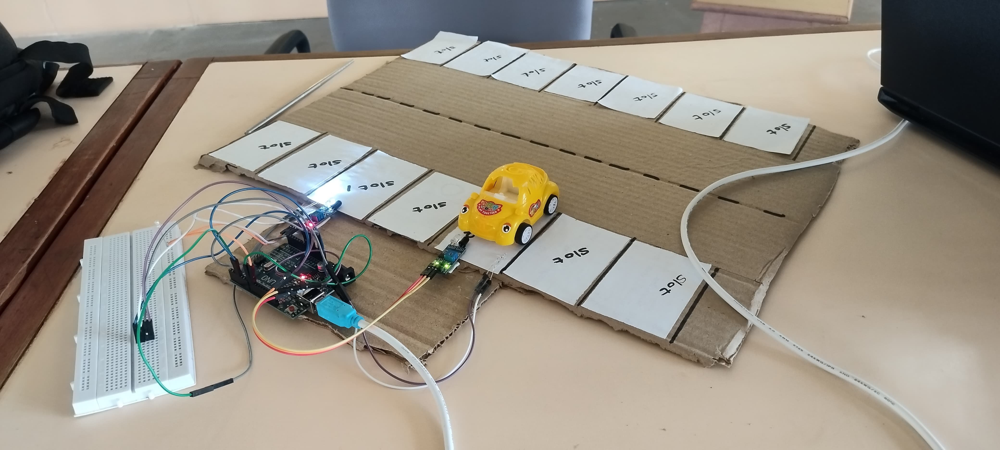
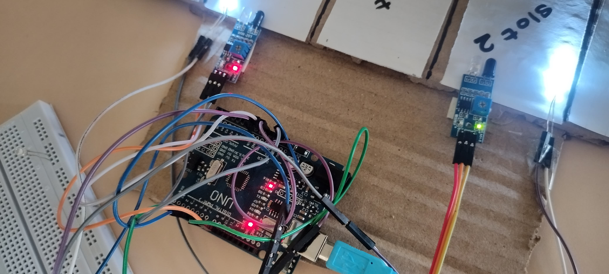

# Autonomous Parking Management System

An end-to-end cyber-physical parking management system that detects real-time parking-slot occupancy using IR sensors, processes sensor data through a Java client-server architecture, and visualizes parking status through a local Flask web interface.

## Overview

The system integrates embedded sensing, serial communication, client-server programming, backend processing, and real-time visualization.

**System Flow:**

IR Sensors → Arduino UNO → Serial Communication → Java Client → Java Server → Flask Web Interface

LEDs connected to the parking slots provide physical occupancy indication alongside the web-based visualization.

## Key Features

- Real-time parking-slot occupancy detection
- Multiple IR sensors representing individual parking slots
- Arduino UNO-based sensor acquisition
- Serial communication between Arduino and laptop
- Java client-server architecture for sensor-data processing
- Flask-based local web interface
- Visual parking occupancy map
- LED-based physical occupancy indicators

## Technology Stack

- **Embedded:** Arduino UNO, IR Sensors, LEDs
- **Programming:** Java, Python
- **Communication:** Serial Communication, Client-Server Communication
- **Backend/Web:** Flask, HTML, CSS

## System Workflow

### 1. Sensor Detection

Each parking slot is monitored using an IR sensor. The sensor state changes when a vehicle occupies or leaves the slot.

### 2. Arduino Data Acquisition

The Arduino UNO continuously reads the sensor states and transmits the collected data to the laptop through serial communication.

### 3. Java Client

The Java client receives the serial data stream from the Arduino and forwards the sensor information to the server.

### 4. Java Server

The Java server processes the incoming sensor data and determines the occupancy state of each parking slot.

### 5. Flask Visualization

The processed occupancy information is displayed through a locally hosted Flask web application as a parking occupancy map.

### 6. Physical Indication

LEDs associated with the parking slots provide a physical indication of whether each slot is occupied or available.

## Project Images

### Hardware Setup

<!-- Replace this with your hardware setup image -->

